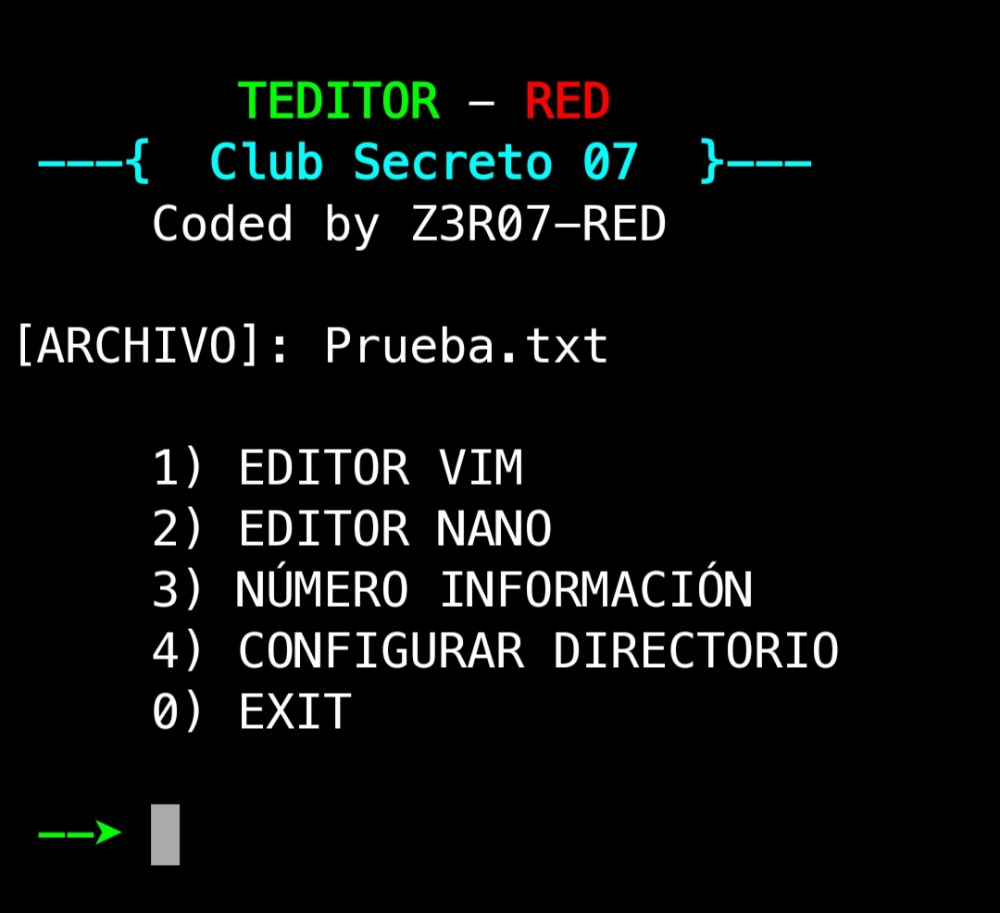
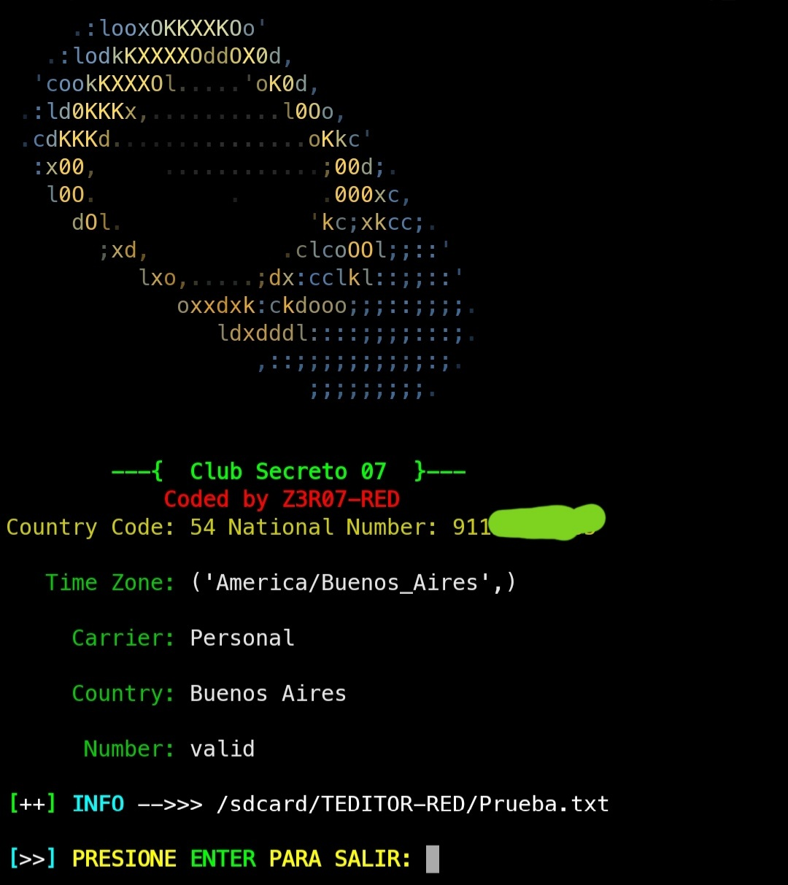

## TEDITOR-RED
A simple script for termux created as an experiment and example, to quickly run a tool.
<p align="center">

</p>

Actualmente, este script configura termux para poder abrir un archivo desde nuestro explorador de archivos con termux, usando nano o vim. Y si comparte algún texto con termux, lo guarda en un archivo que usted especifique. También tiene incorporado un pequeño script que al compartir un número de teléfono con termux, da los detalles del número como su línea, país, si es un número válido, etc. Como dice al principio, ¡es solo un pequeño ejemplo de lo que se puede hacer con termux!

<p align="center">

</p>

### ¿Como lo instalo?
Su instalación es muy sencilla.

Descargar:

```
git clone https://github.com/Z3R07-RED/TEDITOR-RED.git
```

Instalar:

* `cd TEDITOR-RED/`
* `chmod +x TEDITOR-RED.sh`
* `bash TEDITOR-RED.sh`
